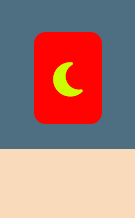

#  Dice Roller

This is a simple dice-rolling website; it has a few types of different dice to offer, so it could be used for all kinds of board games or tabletop RPGs. The tool could also be useful for people with visual impairments, and I would like to add more features to push this project in that direction.

## Features 

### Existing Features

- __Dice select menu__

  - This section will allow the user to choose what kind of die to roll; it currently has four choices: six-sided, eight-sided, ten-sided, and twenty-sided.

- __Giant dice__

  - The square in the center of the page will show the number generated after the user presses the button below.

- __Dark or Light mode__

  - The page has a dark and light mode that can be switched between using the button on the top right side of the page.

- __The Footer__ 

  - The footer section only has a brief disclaimer about the purpose of the website.

### Features Left to Implement

- A way to add more dice to the same roll and have them appear on the screen. Would be very useful for those games that require it.
- A way to establish a target number and have the number of dice that reached that number or higher displayed on a separate area
- Make the site more accessible and add an audio prompt announcing the results.

## Testing 

**TEST** | **ACTION** | **EXPECTATION** | **RESULT** 
----------|----------|----------|----------
Home page	| Size to 320px using Chrome Dev Tools	| Elements look good @ 320px | Works as expected
Home page	| Size to 1920px using Chrome Dev Tools | Elements look good 1920px | Works as expected
Nav bar - home page | Click nav buttons | That each nav element takes me to the correct page site page | Works as expected

### Validator Testing 

- HTML
  - No errors were returned when passing through the official [W3C validator](https://blackboltbeta.github.io/Dice-Roller/)
- CSS
  - No errors were found when passing through the official [(Jigsaw) validator](https://jigsaw.w3.org/css-validator/validator?uri=https%3A%2F%2Fblackboltbeta.github.io%2FDice-Roller%2F&profile=css3svg&usermedium=all&warning=1&vextwarning=&lang=en)

- JSHint
  - No errors were returned when testing script.js through the [JSHint Linter](https://jshint.com/)

- Lighthouse Audit 

## Deployment

 
- The site was deployed to GitHub pages. The steps to deploy are as follows: 
  - In the GitHub repository, navigate to the Settings tab 
  - From the source section drop-down menu, select the Master Branch
  - Once the master branch has been selected, the page will be automatically refreshed with a detailed ribbon display to indicate the successful deployment. 

The live link can be found here - https://blackboltbeta.github.io/Dice-Roller/

## Credits 

Resources and tutorials used for developing this project:
- [JavaScript Simple Dice Roller](https://codepen.io/Pyremell/pen/eZGGXX/) by [Jacob Schaefer](https://codepen.io/Pyremell)
-  [Roll dice!](https://codepen.io/lenasta92579651/pen/yLeVmdW) by [Lena Stanley](https://codepen.io/lenasta92579651/)

Massive thanks to [Lauren-Nicole Popich](https://www.linkedin.com/in/lauren-nicole-popich-1ab87539/) my Code Institute mentor, for her guidance.

### Content 

- The icons in the footer were taken from [Font Awesome](https://fontawesome.com/)